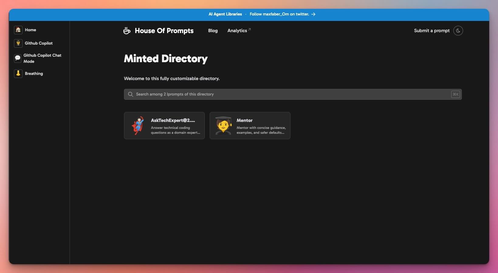
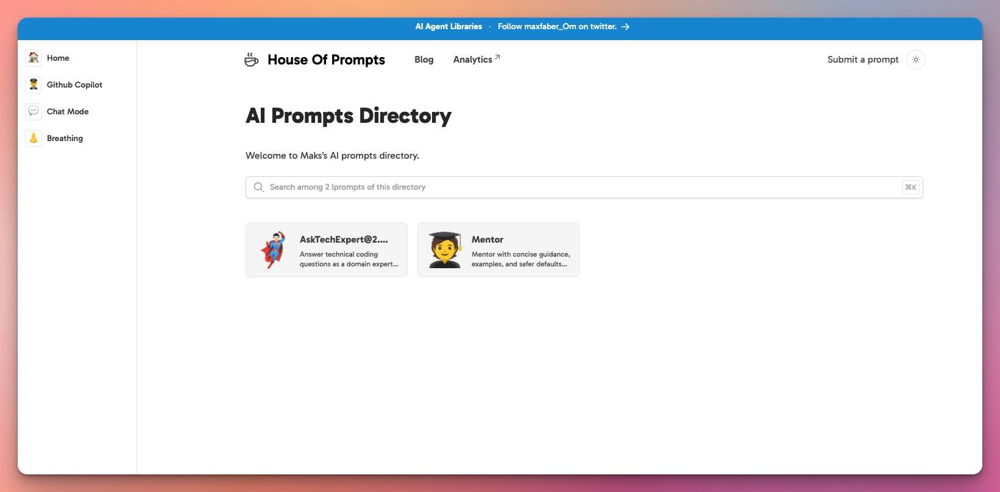

<div align="center" id="top">

  

  &#xa0;

  <!-- <a href="https://houseofprompts.netlify.app">Demo</a> -->
</div>

<h1 align="center">House Of Prompts</h1>

<p align="center">
  
  
  
  
</p>

<!-- Menu -->
<p align="center">
  <a href="#dart-about">About</a> &#xa0; | &#xa0;
  <a href="#sparkles-features">Features</a> &#xa0; | &#xa0;
  <a href="#white_check_mark-requirements">Requirements</a> &#xa0; | &#xa0;
  <a href="#checkered_flag-starting">Getting Started</a> &#xa0; | &#xa0;
  <a href="#memo-license">License</a> &#xa0; | &#xa0;
  <a href="https://github.com/{{YOUR_GITHUB_USERNAME}}" target="_blank">Author</a>
</p>

<br>

## :dart: About ##  

A curated collection of AI prompts, snippets, workflows, and examples for easy reference and collaboration. Run website locally or publish on GitHub Pages. Organized for efficiency and optimized for rapid reuse across different AI applications and use cases. Search by title or tag.

## :sparkles: Features ##  

+ Ready-to-use prompts for common AI applications  
+ Code/prompt snippets saved in markdown format  
+ Categorized by AI tool (e.g., GitHub Copilot, Claude Code) and use case  
+ Community-driven improvements through collaborative editing  
+ 🌙 Dark/Light mode
+ 👀 Tags + Search

<br>
<div align="center" id="top">

<br>
<br>

</div>

## :white_check_mark: Requirements ##  

Only Git is required to contribute or use this repository.

## :checkered_flag: Getting Started ##  

```bash
# Clone repository
$ git clone https://github.com/MaksimZinovev/house-of-prompts.git

# Navigate to directory
$ cd house-of-prompts

```

## Quick start  / Local Development

Duplicate the template then clone the repository.

```sh
git clone git@github.com:youraccount/projectname.git my-prompts
```

Or use the github cli to create a repository based on the template and clone in one command:

```sh
gh repo create my-directory --template MaksimZinovev/my-prompts --private --clone
```

Go to the cloned folder:

```sh
cd my-directory
```

Install dependencies

```sh
pnpm install
```

Run the website:

```sh
pnpm dev
```

Congrats :tada:

You can start customizing and building your directory.

## Adding Content

Adding content to the directory can be done using one of the following formats:

+ markdown
+ json
+ csv
+ notion
+ google sheets
+ airtable

Remember that listings will not be shown on the live website until the site is re-built and deployed. This is done to ensure the fastest possible performance by serving static html, css and js.

### Using markdown listings

1. add markdown files to the `src/data/directory` folder. All markdown files will be automatically loaded as listings.
2. You must specify required properties of a listing such as title and description in the [frontmatter]() of the file

### Using json listings

1. add a single json file: `src/data/directory/directory.json`
2. in this json file, the root element is an array. This array can contain objects which are the listings of the directory. These require the properties of `id`, `name` and `description`.

### Using csv listings

1. add a single csv file: `src/data/directory/directory.csv`
2. add rows to this csv file, these require the properties of `id`, `name` and `description`.

### Using google sheets listings

1. Create a [google sheets](https://docs.google.com/spreadsheets/u/0/) document.
2. You need to select your table and click `Format > Convert to table`
3. Make it publicly shareable. When you share the link. copy the id
4. Go to `settings.toml`, here you need to set the `source=sheets` and `key =` the copied id of the file

Use this spreadsheet as a starting point: [directory google sheet data](https://docs.google.com/spreadsheets/d/1BKVVFysQT8ZuPY8hUp--jwTrN-U20TrtML0idECIWmc/edit?usp=sharing)

## Customization

To customize the directory style:

+ Change the `--color-primary-x00` variables, `--color-gray-x00` variables in the `src/styles/global.css`
+ Change the font:
  + install from [fontsource]()
  + import font in `BaseLayout.astro`
  + change the `--font-sans` variable in `global.css`
+ Customize the `src/data/config/settings.toml` to your preferences.

### Pre-made styles

+ spearmint
+ peppermint
+ hemingway
+ brookmint

### Adding Content

Add listings by adding markdown files to `/src/content/directory`

## Deployment

Deploy as a static site for best SEO performance:

```bash
pnpm run build
```

## Todo

+ [x] Add 2 prompts
+ [x] Customize theme
+ [ ] Deploy to GitHub pages
+ [ ] Add 10 more prompts
+ [ ] Add blog 1 post
+ [ ] Add multiple prompt formats
+ [ ] Add prompt views stats
